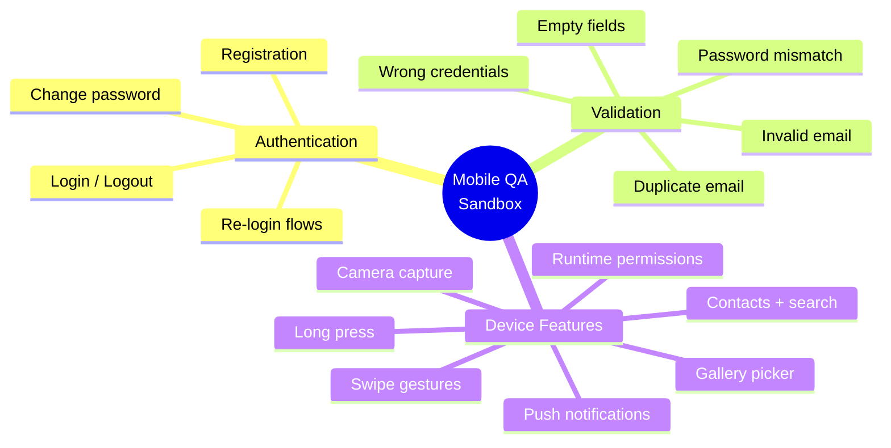
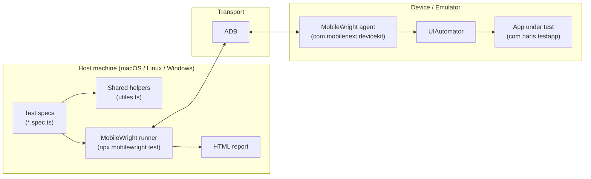
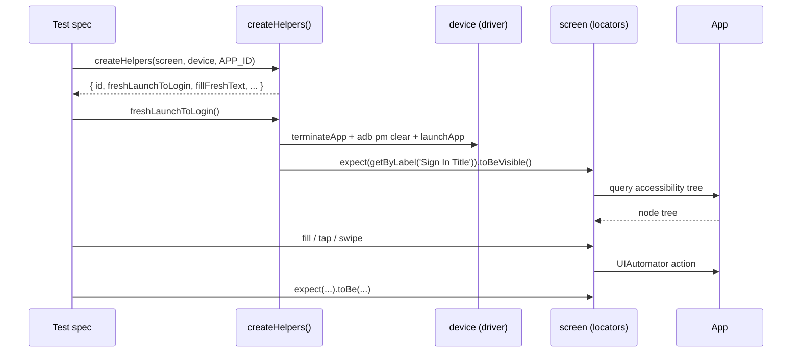
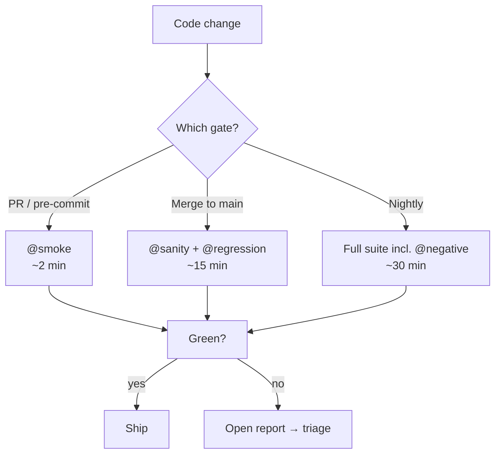
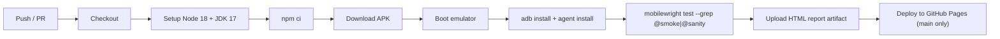
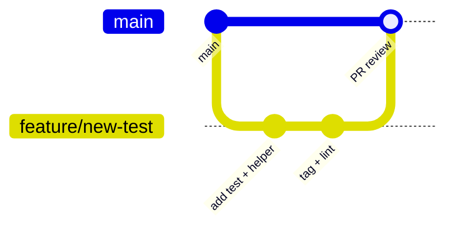

# MobileWright — Android Test Suite

[](https://mobilewright.dev/docs/)
[](https://developer.android.com)
[](https://www.typescriptlang.org)
[](https://nodejs.org)
[](#test-suites)
[](https://sharisroy.github.io/mobilewright-testapp/)

Comprehensive UI automation for the **Mobile QA Sandbox** Android app
([`com.haris.testapp`](https://github.com/sharisroy/mobile-qa-sandbox)), built on
[**MobileWright**](https://mobilewright.dev/docs/) — a Playwright-style framework for
native Android and iOS automation.

The suite covers the full account lifecycle (register → login → update profile → change
password → re-login), every negative/validation path, and advanced device features
(long-press, swipe gestures, runtime permissions, contacts, camera, gallery, push
notifications).

> **New here?** Jump to the [10-Minute Quick Start](#-10-minute-quick-start). You will have a
> green test run before your coffee gets cold.

---

## Table of Contents

**Getting Oriented**
- [Project Overview](#project-overview)
- [Framework Architecture](#framework-architecture)
- [Repository Structure](#repository-structure)

**Setup (Beginner)**
- [10-Minute Quick Start](#-10-minute-quick-start)
- [Prerequisites & Required Software](#prerequisites--required-software)
  - [Node.js](#1-nodejs-v18) · [Java / JDK](#2-java--jdk-17) · [Android Studio](#3-android-studio--android-sdk) · [ADB](#4-adb-setup--verification) · [Git](#5-git)
- [Clone the Repository](#clone-the-repository)
- [Install Dependencies](#install-dependencies)
- [Install the MobileWright Agent](#install-the-mobilewright-agent)
- [Environment Setup](#environment-setup)

**The App Under Test**
- [Download, Install & Launch the App](#download-install--launch-the-app)
- [Connect & Verify Devices](#connect--verify-devices)

**Running Tests (Intermediate)**
- [Build the Project](#build-the-project)
- [Run Tests](#run-tests)
- [Run by Tag — Smoke / Regression / Sanity](#run-by-tag--smoke--regression--sanity)
- [Run on Emulator / Physical Device / iOS](#run-on-emulator--physical-device--ios)
- [Test Suites](#test-suites)

**Operations (Advanced)**
- [Reporting & Report Sharing](#reporting--report-sharing)
- [Debugging & Troubleshooting](#debugging--troubleshooting)
- [Best Practices](#best-practices)
- [CI/CD Integration](#cicd-integration)
- [FAQ](#faq)
- [Contribution Guidelines](#contribution-guidelines)
- [Documentation (Tutorial & Reference)](#documentation)

---

## Project Overview

| | |
|---|---|
| **What it is** | An automated regression + feature test suite for a personal-information Android app. |
| **App under test** | `com.haris.testapp` — the [Mobile QA Sandbox](https://github.com/sharisroy/mobile-qa-sandbox) APK. |
| **Framework** | [MobileWright](https://mobilewright.dev/docs/) `^0.0.41` — Playwright-style API (`screen`, `device`, `expect`, fixtures, HTML reporter). |
| **Language** | TypeScript (ESM, `"type": "module"`). |
| **Tests** | 35+ across 3 spec files — happy path, validation/negative paths, and advanced device features. |
| **Tagging** | `@smoke`, `@regression`, `@sanity`, `@negative` for selective execution. |
| **Platforms** | Android (primary). MobileWright also supports iOS; see [iOS](#run-on-emulator--physical-device--ios). |

### What the suite validates



---

## Framework Architecture

MobileWright drives a small on-device **agent** (installed once per device) over ADB. Your
TypeScript specs call high-level `screen` / `device` APIs; the agent translates those into
UIAutomator actions on the device and returns the accessibility tree.



### Test execution model



### Design principles used in this repo

- **Helper factory over page objects.** `createHelpers(screen, device, APP_ID)` returns a
  closure of helpers scoped to one test fixture — see [`tests/advance/utiles.ts`](tests/advance/utiles.ts).
- **Locator priority:** `getByLabel` → `getByTestId` → `getByRole` → `getByText` → `getByType`.
- **Resilient reads:** off-screen values are read from `screen.viewTree()` (the full tree),
  not from `getText()` (visible-only).
- **Deterministic data:** every run uses a unique email (`haris+<runId>@mail.com`) so reruns
  never collide with leftover server state.
- **Self-healing locators:** `findVisibleElement([...candidates], maxSwipes)` scrolls until any
  candidate locator resolves.

---

## Repository Structure

```
mobilewright/
├── tests/
│   ├── basic_testApp.spec.ts        # BEGINNER — self-contained smoke + happy-path (2 tests)
│   └── advance/
│       ├── testApp.spec.ts          # ADVANCED — happy path + 12 negative tests (13 tests)
│       ├── explore.spec.ts          # ADVANCED — device features: gestures, permissions,
│       │                            #            contacts, camera, gallery, notifications (~20)
│       ├── utiles.ts                # Shared helper factory, USER fixture, ERROR strings
│       ├── inspect.spec.ts          # Utility — dump the accessibility tree of a screen
│       ├── debug_date.spec.ts       # Utility — debug the date-picker interaction
│       ├── users.json               # Static test-data sample
│       └── mobilewright.config.ts   # Config scoped to the advance/ suite
├── mobilewright.config.ts           # Root config (testDir: ./tests)
├── package.json                     # Scripts + dependencies
├── package-lock.json
├── playwright-report/               # Generated HTML report (git-ignored)
├── test-results/                    # Per-test artifacts (git-ignored)
├── MOBILEWRIGHT_TUTORIAL.pdf        # Tutorial + full reference (the cheat sheet, folded in)
└── README.md                        # You are here
```

### Configuration files

There are **two** config files — the runner picks up `mobilewright.config.ts` from the
working directory (or `--config`).

**`mobilewright.config.ts`** (root — used by `npm test`):

```ts
import { defineConfig } from 'mobilewright';
import { execSync } from 'child_process';

// With both an emulator and a physical device connected, mobilewright otherwise
// picks the first online device (.at(0)) — non-deterministic. Pin one:
//   1. MW_DEVICE_ID / ANDROID_SERIAL if set, else
//   2. the first PHYSICAL device (its mobilecli id == its adb serial).
// tests/advance/utiles.ts (getAdbSerial) resolves the SAME device, so the
// driver and raw adb calls always act on the same one.
function resolveDeviceId(): string | undefined {
  if (process.env.MW_DEVICE_ID) return process.env.MW_DEVICE_ID;
  if (process.env.ANDROID_SERIAL) return process.env.ANDROID_SERIAL;
  try {
    const out = execSync('adb devices', { encoding: 'utf8' });
    const serials = out.split('\n')
      .filter(l => l.includes('\tdevice'))
      .map(l => l.split('\t')[0].trim());
    return serials.find(s => !s.startsWith('emulator-')); // undefined → mobilewright chooses
  } catch { return undefined; }
}

export default defineConfig({
  testDir: './tests',
  reporter: 'html',
  platform: 'android',
  timeout: 30_000,           // global locator + RPC timeout in ms
  deviceId: resolveDeviceId(), // deterministic device when emulator + phone are both connected
});
```

**`tests/advance/mobilewright.config.ts`** (advanced suite — sequential, file-parallel):

```ts
import { defineConfig } from 'mobilewright';

export default defineConfig({
  testDir: '.',
  reporter: 'html',
  platform: 'android',
  timeout: 30_000,        // individual tests override via test.setTimeout()
  workers: 1,             // sequential — avoids clashing on the shared test account
  fullyParallel: true,    // parallelize at the file level, not per-test
});
```

> `timeout` is the per-locator/RPC ceiling. Long end-to-end tests raise the **test** ceiling
> with `test.setTimeout(600_000)` (see the happy-path test) — the two are independent.

---

## 🚀 10-Minute Quick Start

For engineers who already have Node, Java, Android Studio, and a device/emulator ready:

```bash
# 1. Clone
git clone https://github.com/sharisroy/mobilewright-testapp.git
cd mobilewright-testapp

# 2. Install dependencies
npm install

# 3. Confirm a device is connected
adb devices                       # should list one "device"

# 4. Install the MobileWright agent (once per device)
npx mobilewright install

# 5. Download + install the app under test (see "Download the App" for the link)
adb install path/to/mobile-qa-sandbox.apk

# 6. Run the beginner smoke test
npx mobilewright test tests/basic_testApp.spec.ts --grep @smoke

# 7. Open the report
npx mobilewright show-report
```

New to mobile automation? Read on — every step is broken down below.

---

## Prerequisites & Required Software

| Software | Minimum version | Why |
|---|---|---|
| **Node.js** | 18 LTS | Runs the MobileWright CLI + your TS specs |
| **Java / JDK** | 17 | Required by the Android SDK / `adb` toolchain |
| **Android Studio** | latest | Bundles the Android SDK, platform-tools (ADB) & emulator |
| **ADB** | bundled with SDK | Talks to the device/emulator |
| **Git** | any recent | Clone the repo |

### 1. Node.js (v18+)

Download the LTS from [nodejs.org](https://nodejs.org), then verify:

```bash
node --version    # v18.x.x or higher
npm  --version
```

> **Tip:** use a version manager — [`nvm`](https://github.com/nvm-sh/nvm) on macOS/Linux,
> [`nvm-windows`](https://github.com/coreybutler/nvm-windows) on Windows: `nvm install 18 && nvm use 18`.

### 2. Java / JDK (17)

The Android command-line tools require a JDK. Install **Temurin 17** from
[adoptium.net](https://adoptium.net/) or via a package manager:

```bash
# macOS (Homebrew)
brew install --cask temurin17

# Ubuntu / Debian
sudo apt install openjdk-17-jdk

# Windows (winget)
winget install EclipseAdoptium.Temurin.17.JDK
```

Set `JAVA_HOME` and verify:

```bash
# macOS / Linux — add to ~/.zshrc or ~/.bashrc
export JAVA_HOME="$(/usr/libexec/java_home -v 17)"   # macOS
# export JAVA_HOME=/usr/lib/jvm/java-17-openjdk-amd64 # Linux

java -version     # should print 17.x
echo $JAVA_HOME
```

### 3. Android Studio & Android SDK

Install [Android Studio](https://developer.android.com/studio) — it bundles the SDK,
**platform-tools** (which includes ADB), and the emulator.

After install, open **Android Studio → Settings → Languages & Frameworks → Android SDK** and
ensure these are checked:
- **Android SDK Platform** (API 31 or higher)
- **Android SDK Platform-Tools**
- **Android Emulator**
- At least one **system image** (for an AVD)

### 4. ADB Setup & Verification

ADB ships inside `platform-tools`. Add it to your `PATH`:

```bash
# macOS / Linux — add to ~/.zshrc or ~/.bashrc
export ANDROID_HOME="$HOME/Library/Android/sdk"        # macOS
# export ANDROID_HOME="$HOME/Android/Sdk"              # Linux
export PATH="$PATH:$ANDROID_HOME/platform-tools:$ANDROID_HOME/emulator:$ANDROID_HOME/tools:$ANDROID_HOME/tools/bin"
```

```powershell
# Windows (PowerShell, persist for the user)
setx ANDROID_HOME "$env:LOCALAPPDATA\Android\Sdk"
setx PATH "$env:PATH;$env:LOCALAPPDATA\Android\Sdk\platform-tools"
```

Verify:

```bash
adb version       # Android Debug Bridge version 1.x.x
adb devices       # lists connected devices/emulators
```

### 5. Git

Install from [git-scm.com](https://git-scm.com), then `git --version`.

### One-shot environment check

MobileWright ships a `doctor` command that validates your whole setup:

```bash
npx mobilewright doctor
```

It reports on Node, JDK, ADB, connected devices, and the agent — run it first whenever
something looks off.

---

## Clone the Repository

```bash
git clone https://github.com/sharisroy/mobilewright-testapp.git
cd mobilewright-testapp
```

> Replace the URL with your fork's URL if you intend to contribute.

---

## Install Dependencies

```bash
npm install
```

This installs everything declared in `package.json`:

| Package | Role |
|---|---|
| `mobilewright` | The CLI + runner (`npx mobilewright …`) |
| `@mobilewright/test` | The test API — `test`, `expect`, fixtures (`screen`, `device`) |
| `@types/node` | Node typings (the helpers use `child_process` / `execSync`) |

`package.json` scripts:

```jsonc
{
  "type": "module",
  "scripts": {
    "test": "mobilewright test",                       // runs everything under testDir
    "test:file": "mobilewright test tests/testApp.spec.ts"
  }
}
```

> **Note:** `npm run test:file` points at a legacy path. Prefer the explicit forms in
> [Run Tests](#run-tests), e.g. `npx mobilewright test tests/advance/testApp.spec.ts`.

---

## Install the MobileWright Agent

MobileWright needs a small helper app on the device. Install it **once per device** (and
again after a full reboot or after wiping the device):

```bash
npx mobilewright install
```

Expected output:

```json
{ "status": "ok", "data": { "message": "Agent installed successfully" } }
```

Multiple devices connected? Target one explicitly:

```bash
adb devices                                            # find the serial
npx mobilewright install --device emulator-5554
```

---

## Environment Setup

When an emulator and a physical device are connected at the same time, the suite picks **one
device deterministically** so the driver and every ADB call act on the same target:

- The root [`mobilewright.config.ts`](mobilewright.config.ts) resolves `deviceId`, and the
  helpers in [`tests/advance/utiles.ts`](tests/advance/utiles.ts) (`getAdbSerial`) resolve the
  same serial.
- Order of precedence: `MW_DEVICE_ID` → `ANDROID_SERIAL` → first **physical** device → first
  online device. So by default a connected phone wins over an emulator — no env var needed.

| Variable | Purpose | Example |
|---|---|---|
| `MW_DEVICE_ID` | Pins both the driver and ADB calls to one device (mobilecli id / adb serial) | `MW_DEVICE_ID=emulator-5554 npm test` |
| `ANDROID_SERIAL` | Standard adb serial override; also honored by the helper and config | `ANDROID_SERIAL=R5CT30XXXXX npm test` |
| `ANDROID_HOME` | Location of the Android SDK | `$HOME/Library/Android/sdk` |
| `JAVA_HOME` | JDK 17 location | `$(/usr/libexec/java_home -v 17)` |

> The auto-selection means raw `adb` calls in the specs no longer fail with
> `more than one device/emulator` when both an emulator and a phone are attached. To force the
> **emulator** while a phone is plugged in, set `MW_DEVICE_ID`/`ANDROID_SERIAL` to its serial
> (e.g. `emulator-5554`).

---

## Download, Install & Launch the App

The tests run against the **Mobile QA Sandbox** APK.

### 1. Download the APK

**Repository:** <https://github.com/sharisroy/mobile-qa-sandbox>
**Release:** <https://github.com/sharisroy/mobile-qa-sandbox/releases/tag/v1.0.0>

Open the release, expand **Assets**, and download the `.apk` file. From the CLI:

```bash
# Grab the latest release asset with the GitHub CLI
gh release download v1.0.0 \
  --repo sharisroy/mobile-qa-sandbox \
  --pattern '*.apk' \
  --dir ~/Downloads
```

### 2. Install on a device or emulator

```bash
# Single device
adb install ~/Downloads/mobile-qa-sandbox.apk

# Multiple devices — target one
adb -s emulator-5554 install ~/Downloads/mobile-qa-sandbox.apk

# Re-install over an existing copy (keeps data)
adb install -r ~/Downloads/mobile-qa-sandbox.apk
```

**On a physical phone (no cable):** copy the APK to the device, open it in a file manager,
tap it, and allow *Install from unknown sources* when prompted.

### 3. Verify it installed

```bash
adb shell pm list packages | grep com.haris.testapp
# → package:com.haris.testapp
```

### 4. Launch it (the tests do this for you, but to sanity-check manually)

```bash
adb shell monkey -p com.haris.testapp -c android.intent.category.LAUNCHER 1
```

> The suite always starts from a clean slate — `freshLaunchToLogin()` runs
> `adb shell pm clear com.haris.testapp` and relaunches, so you don't need to reset the app
> between runs.

---

## Connect & Verify Devices

### Android Emulator

```bash
# List available virtual devices
emulator -list-avds

# Boot one (headless-friendly; drop the flags to see the window)
emulator -avd Pixel_7_API_34 -no-snapshot -no-boot-anim &

# Wait until it's fully booted
adb wait-for-device
adb shell getprop sys.boot_completed   # prints 1 when ready
```

Create an AVD from the GUI: **Android Studio → Device Manager → Create Device → pick a Pixel →
API 31+**.

### Physical Android Device

1. **Settings → About phone →** tap **Build number** 7 times to unlock Developer Options.
2. **Settings → System → Developer Options →** enable **USB debugging**.
3. Connect via USB and accept the *Allow USB debugging?* prompt on the phone.

```bash
adb devices
# emulator-5554    device     ← emulator
# R5CT30XXXXX      device     ← physical phone
```

Anything showing `unauthorized` means you haven't accepted the on-device prompt;
`offline` usually clears with `adb kill-server && adb start-server`.

List everything MobileWright can see:

```bash
npx mobilewright devices
```

---

## Build the Project

There is **no compile step** — MobileWright executes TypeScript specs directly. "Building" the
project means installing dependencies and the on-device agent:

```bash
npm install                 # install JS dependencies
npx mobilewright install    # install the on-device agent
npx mobilewright doctor      # verify the toolchain end-to-end
```

Want to type-check your specs before running? (optional, requires `typescript`):

```bash
npx tsc --noEmit
```

---

## Run Tests

```bash
# Everything under the root testDir (./tests)
npm test
# equivalent to:
npx mobilewright test

# A single file
npx mobilewright test tests/basic_testApp.spec.ts
npx mobilewright test tests/advance/testApp.spec.ts
npx mobilewright test tests/advance/explore.spec.ts

# A single test by title (regex)
npx mobilewright test --grep "register, login, and update profile"

# List tests without running them
npx mobilewright test --list

# Use the advance suite's own config
npx mobilewright test --config tests/advance/mobilewright.config.ts
```

### Useful `test` options

| Option | Effect |
|---|---|
| `--grep <regex>` | Run only tests whose title **or tag** matches |
| `--grep-invert <regex>` | Run everything **except** matches |
| `--workers <n>` | Concurrency (capped at the number of connected devices) |
| `--retries <n>` | Retry flaky tests up to `n` times |
| `--timeout <ms>` | Override the per-test timeout |
| `--shard <i/total>` | Split the suite across machines, e.g. `1/3` |
| `--reporter <name>` | `html` (default), `list`, or `json` |
| `--config <file>` | Point at a specific config |
| `--list` | Print tests without executing |
| `--pass-with-no-tests` | Exit `0` when no tests match |

---

## Run by Tag — Smoke / Regression / Sanity

Tests are tagged in their titles (`{ tag: ['@smoke', ...] }`). Filter with `--grep`:

| Suite | Command | What runs |
|---|---|---|
| **Smoke** | `npx mobilewright test --grep @smoke` | Fast confidence check — app launches, core gestures work |
| **Sanity** | `npx mobilewright test --grep @sanity` | Critical happy-path slices |
| **Regression** | `npx mobilewright test --grep @regression` | The broad functional sweep |
| **Negative** | `npx mobilewright test --grep @negative` | Validation / error-path coverage |

```bash
# Combine tags (regex alternation)
npx mobilewright test --grep "@smoke|@sanity"

# Everything EXCEPT the slow negative paths
npx mobilewright test --grep-invert @negative

# Tag within a single file
npx mobilewright test tests/advance/explore.spec.ts --grep @smoke
```



---

## Run on Emulator / Physical Device / iOS

### Android Emulator

```bash
emulator -avd Pixel_7_API_34 &
adb wait-for-device
npx mobilewright install
npx mobilewright test tests/advance/testApp.spec.ts
```

### Physical Android Device

```bash
# A connected phone is auto-selected over an emulator — no env var needed:
npx mobilewright test tests/advance/explore.spec.ts --grep "notification"

# To force a specific target when several are attached:
adb devices
MW_DEVICE_ID=R5CT30XXXXX npx mobilewright test tests/advance/testApp.spec.ts
# (ANDROID_SERIAL=R5CT30XXXXX … and --device R5CT30XXXXX also work)
```

> Coordinate-based gestures (e.g. scrolling to the Notifications section) are
> **resolution-relative** — derived from `adb shell wm size` — so they work unchanged across
> the emulator and higher-resolution physical screens. Avoid hardcoding pixel coordinates in
> new tests for the same reason.

### Multiple devices in parallel

The advance config sets `workers: 1` for state safety, but with several physical devices you
can scale out — MobileWright caps workers at the number of connected devices automatically:

```bash
npx mobilewright test tests/advance/explore.spec.ts --workers 2
```

### iOS Simulator (framework capability)

MobileWright is cross-platform — `getByRole`, `getByLabel`, gestures, and assertions all map
to `XCUIElement` types on iOS, and you'd set `platform: 'ios'` in the config or
`test.use({ platform: 'ios' })`.

> ⚠️ **This repo's app under test is Android-only** (`com.haris.testapp`, distributed as an
> APK). To exercise the iOS path you need an iOS build (`.app`) of the sandbox plus Xcode +
> an iOS Simulator. The locator strategies in these specs are written against Android resource
> IDs (`com.haris.testapp:id/...`), so they would need iOS equivalents. Treat iOS support as a
> framework feature, not something wired up in this repository today.

---

## Test Suites

### `tests/basic_testApp.spec.ts` — Beginner (2 tests)

Self-contained (helpers inline), the gentlest introduction to the API.

| # | Test | Tag |
|---|---|---|
| 1 | List apps installed on the device; assert the sandbox is present | `@smoke` |
| 2 | Register → login → update full profile (DOB, gender, marital status, address, mobile, terms) → verify | `@regression` |

### `tests/advance/testApp.spec.ts` — Advanced (13 tests)

Uses the shared `createHelpers()` factory. One full happy path + 12 negative paths.

| # | Test | Tag |
|---|---|---|
| 1 | Full lifecycle: register → login → update profile → change password → logout → re-login with new password | `@regression @sanity` |
| 2 | Registration rejects mismatched confirm password | `@negative` |
| 3 | Registration blocked when all fields empty | `@negative` |
| 4 | Registration rejects duplicate email | `@negative` |
| 5 | Login rejects wrong password | `@negative` |
| 6 | Login rejects unregistered email | `@negative` |
| 7 | Login blocked with empty email | `@negative` |
| 8 | Login blocked with empty password | `@negative` |
| 9 | Login blocked with both fields empty | `@negative` |
| 10 | Login rejects invalid email format | `@negative` |
| 11 | Old password rejected after a password change | `@negative` |
| 12 | Change-password rejects wrong current password | `@negative` |
| 13 | Change-password rejects mismatched new passwords | `@negative` |

### `tests/advance/explore.spec.ts` — Advanced device features (~20 tests)

Gestures, runtime permissions, and system-app interactions.

| Area | Coverage | Tags |
|---|---|---|
| Explore screen | Button visible pre-login; opens features screen | `@regression` |
| Long press | Hold shows bottom sheet; dismiss with *GOT IT* | `@regression @sanity @smoke` |
| Swipe card | Swipe right shows success | `@regression @sanity @smoke` |
| Contacts | Section visible; permission dialog; allow → list; search; deny stays empty; select result | `@regression @negative` |
| Camera | Section visible; permission dialog; deny path; grant → capture | `@regression @negative` |
| Gallery | Section visible; picker opens; pick a photo | `@regression` |
| Notifications | Section visible; permission handled; channel active; push delivered to shade | `@regression @smoke` |

### Utility specs

- [`tests/advance/inspect.spec.ts`](tests/advance/inspect.spec.ts) — dumps the live
  accessibility tree of a screen. Run it to discover locators for new elements.
- [`tests/advance/debug_date.spec.ts`](tests/advance/debug_date.spec.ts) — isolates the
  Material date-picker interaction for debugging.

---

## Reporting & Report Sharing

After any run, MobileWright writes an HTML report to `playwright-report/`.

```bash
# Open the last report in a browser
npx mobilewright show-report

# Choose a reporter at run time
npx mobilewright test --reporter html      # rich UI (default)
npx mobilewright test --reporter list      # streaming console output
npx mobilewright test --reporter json      # machine-readable, for dashboards
```

The report shows per-test status, console logs, step timings, and **screenshots on failure**.

### View the latest report online (GitHub Pages)

CI publishes the HTML report to **GitHub Pages** after every run on `main`, so you can read it
in a browser without downloading an artifact:

**🔗 [sharisroy.github.io/mobilewright-testapp](https://sharisroy.github.io/mobilewright-testapp/)**

The page is refreshed by the `deploy-report` job in
[`.github/workflows/mobile-tests.yml`](.github/workflows/mobile-tests.yml) — it always shows
the **most recent `main` run** (published even when tests fail, so failures stay debuggable).
For a specific run, open **Actions → the run → `deploy-report`** and use the URL in its
`github-pages` environment box.

> **First-time setup (once per repo):** Settings → Pages → *Build and deployment* →
> **Source: GitHub Actions**. Then push to `main` (or run the workflow manually) to publish the
> first report. PR runs intentionally don't publish — they only attach the downloadable
> artifact below — so they can't overwrite the live `main` report.

### Sharing reports

```bash
# Zip the report folder for email / Slack
zip -r report.zip playwright-report

# Serve it on your LAN for a quick share
npx serve playwright-report
```

### Sharded runs

When you split a run across machines/shards, merge the blob reports into one:

```bash
npx mobilewright test --shard 1/3   # machine A
npx mobilewright test --shard 2/3   # machine B
npx mobilewright test --shard 3/3   # machine C
npx mobilewright merge-reports ./blob-reports
```

> `playwright-report/` and `test-results/` are git-ignored — they're build artifacts, not
> source.

---

## Debugging & Troubleshooting

### Discover an element's locator

```bash
npx mobilewright test tests/advance/inspect.spec.ts
```

…or take a screenshot of the current screen:

```bash
npx mobilewright screenshot --output screen.png
```

### Common issues

| Symptom | Cause | Fix |
|---|---|---|
| `adb: more than one device/emulator` | Multiple devices attached | Specs auto-pick the physical device; override with `MW_DEVICE_ID=<serial>` / `ANDROID_SERIAL=<serial>` |
| Scroll/tap misses on a physical device | Hardcoded pixel coordinates tuned for the emulator | Use resolution-relative coords (`getScreenSize()` from `wm size`), as the notification scroll helpers now do |
| `agent not installed` | Agent wiped (often after a reboot) | `npx mobilewright install` |
| `no XML content found in uiautomator dump` | UIAutomator crashed under load | `adb reboot` → wait 30s → `npx mobilewright install` → rerun |
| `pm clear failed / Could not clear app data` | Ambiguous device | Set `ANDROID_SERIAL` (see above) |
| Locator times out after scrolling | Element off-screen; `getText()` is visible-only | Read from `screen.viewTree()` / use `findVisibleElement([...], maxSwipes)` |
| Dropdown option not found | `AutoCompleteView` popups aren't in the a11y tree | Tap by computed coordinate (`selectDropdownItem`) |
| Typed text lands in the wrong field | Soft keyboard overlaps the next field | `await dismissKeyboard()` before filling the next field |
| Registration errors on a 2nd run | Leftover server account | The suite already uses a unique `haris+<runId>@mail.com`; confirm `_runId` exists in `utiles.ts` |
| Tests pass solo, flake in a batch | Previous test left a system app (camera/gallery) in foreground | `explore.spec.ts` force-stops those packages in `afterEach`; mirror that pattern |

### Verbose ADB / connection reset

```bash
adb kill-server && adb start-server     # reset the ADB daemon
adb logcat | grep com.haris.testapp     # tail the app's logs while a test runs
```

---

## Best Practices

These are the conventions this repo already follows — keep them when extending it.

1. **Respect locator priority.** `getByLabel` → `getByTestId` → `getByRole` → `getByText` →
   `getByType`. Never reach for `getByText` on a button you could target by label/ID.
2. **Keep the DRY `id()` helper.** `const id = v => \`${APP_ID}:id/${v}\`` — never hard-code
   `com.haris.testapp:id/...` in new tests.
3. **Read off-screen state from the tree,** not from `getText()`. Use `collectAll(await screen.viewTree())`.
4. **Start every test from a clean slate.** Call `freshLaunchToLogin()` (terminate + `pm clear`
   + relaunch) so tests don't depend on each other.
5. **Unique data per run.** Reuse the `USER` fixture with its `runId`-suffixed email.
6. **Set realistic timeouts.** Global locator timeout stays at `30_000`; long flows raise the
   **test** timeout (`test.setTimeout(600_000)`), not the global one.
7. **Soft-assert error visibility.** `waitForErrorVisible(text)` polls the tree and returns a
   boolean — assert on that, don't throw mid-poll.
8. **Tag every test** (`@smoke` / `@sanity` / `@regression` / `@negative`) so CI gates can
   select it.
9. **Clean up system apps you launched** (camera/gallery/picker) in `afterEach`, as
   `explore.spec.ts` does, so the next test can foreground the app.
10. **Prefer `device.driver` gestures** (`tap`, `swipe`, `longPress`) for coordinate-based
    interactions the a11y tree can't express.

---

## CI/CD Integration

CI runs need an emulator (or a self-hosted runner with a physical device). The agent must be
installed after the emulator boots and before the tests run.

### GitHub Actions (Android emulator)

```yaml
name: Mobile Tests

on:
  push: { branches: [main] }
  pull_request:

jobs:
  android-tests:
    runs-on: macos-latest          # macOS runners ship HW acceleration for the emulator
    steps:
      - uses: actions/checkout@v4

      - uses: actions/setup-node@v4
        with:
          node-version: 18
          cache: npm

      - uses: actions/setup-java@v4
        with: { distribution: temurin, java-version: 17 }

      - name: Install dependencies
        run: npm ci

      - name: Download the app under test
        run: |
          gh release download v1.0.0 \
            --repo sharisroy/mobile-qa-sandbox \
            --pattern '*.apk' --dir .
        env: { GH_TOKEN: ${{ github.token }} }

      - name: Run tests on emulator
        uses: reactivecircus/android-emulator-runner@v2
        with:
          api-level: 34
          arch: x86_64
          profile: pixel_7
          script: |
            adb install -r *.apk
            npx mobilewright install
            npx mobilewright test --grep "@smoke|@sanity" --reporter html

      - name: Upload report
        if: always()
        uses: actions/upload-artifact@v4
        with:
          name: playwright-report
          path: playwright-report
```



**Pipeline tips**

- Gate PRs on `@smoke`; run the full suite (incl. `@negative`) nightly via `schedule:`.
- Use `--shard i/total` across parallel jobs and `merge-reports` to combine results.
- Always `upload-artifact` the report with `if: always()` so failures are debuggable.
- Publish the report to **GitHub Pages** (`actions/deploy-pages`) for a browsable link —
  see [View the latest report online](#view-the-latest-report-online-github-pages).
- Pin `npm ci` (not `npm install`) in CI for reproducible installs.

---

## FAQ

**Q. Do I need Appium?**
No. MobileWright bundles its own on-device agent and driver — `npx mobilewright install` is all
the device-side setup you need.

**Q. Which config does `npm test` use?**
The root [`mobilewright.config.ts`](mobilewright.config.ts) (`testDir: ./tests`), so it runs
every spec. The advance suite has its own config you can point at with
`--config tests/advance/mobilewright.config.ts`.

**Q. Why a unique email each run?**
The backend persists registrations. `USER.email` is suffixed with a base-36 timestamp
(`haris+<runId>@mail.com`) so reruns never hit "email already registered".

**Q. Why `workers: 1` in the advance config?**
All advance tests share one logical account and mutate app state; running them sequentially
avoids cross-test interference. `fullyParallel: true` still lets *files* run in parallel when
multiple devices exist.

**Q. A test passes alone but flakes in the full run — why?**
A previous test likely left a system app (camera/gallery/photo picker) in the foreground.
`explore.spec.ts` force-stops those packages in `afterEach`; replicate that for new
system-interaction tests.

**Q. Can I run on a real iPhone / iOS Simulator?**
The framework supports iOS, but this repo's app is an Android APK and its locators use Android
resource IDs. You'd need an iOS build of the sandbox and iOS-specific locators. See
[iOS](#run-on-emulator--physical-device--ios).

**Q. How do I find the locator for a new element?**
Run [`tests/advance/inspect.spec.ts`](tests/advance/inspect.spec.ts) to dump the accessibility
tree, then pick `label` → `getByLabel`, `resourceId` → `getByTestId`, `text` → `getByText`.

**Q. Where are screenshots/logs after a failure?**
In `test-results/` (per-test artifacts) and inside the HTML report (`npx mobilewright show-report`).

---

## Contribution Guidelines



1. **Branch** off `main`: `git checkout -b feature/<short-description>`.
2. **Place the test correctly:**
   - Simple/standalone learning example → `tests/basic_testApp.spec.ts`.
   - Auth/profile/validation flow → `tests/advance/testApp.spec.ts`.
   - Device feature / permission / gesture → `tests/advance/explore.spec.ts`.
3. **Reuse helpers** from [`tests/advance/utiles.ts`](tests/advance/utiles.ts) — extend the
   factory rather than duplicating logic. Add shared error strings to `ERROR`.
4. **Tag every test** with the appropriate `@smoke` / `@sanity` / `@regression` / `@negative`.
5. **Follow the locator priority** and the [Best Practices](#best-practices).
6. **Run locally before pushing:**
   ```bash
   npx mobilewright test <your-file> --grep "<your test title>"
   npx mobilewright test --grep @smoke        # make sure you didn't break smoke
   ```
7. **Commit style:** short imperative subject (e.g. `add negative test for empty email`).
8. **Open a PR** describing what you added, the device/emulator you verified on, and attach the
   HTML report (or a screenshot) for new flows.

**Review checklist**

- [ ] Test starts from a clean slate (`freshLaunchToLogin()`).
- [ ] Uses the `USER` fixture / `id()` helper — no hard-coded data or resource IDs.
- [ ] Tagged appropriately.
- [ ] Cleans up any system app it launches.
- [ ] Passes locally on at least one emulator **and** a physical device when feasible.

---

## Documentation

A single standalone guide (by **Haris Chandra Roy**) ships alongside this README as a printable
A4 PDF with a cover page and rendered diagrams:

- **[`MOBILEWRIGHT_TUTORIAL.pdf`](MOBILEWRIGHT_TUTORIAL.pdf)** — a guided,
  zero-to-first-green-test tutorial **plus a complete reference (the cheat sheet, folded in)**:
  set up the toolchain, run the suite, read the code lesson by lesson, write and tag your own
  test, then reach for the reference — CLI/ADB commands, locators, gestures, assertions, waits,
  design patterns, interview questions, and quick-reference tables.

---

<div align="center">

Built with [MobileWright](https://mobilewright.dev/docs/) · App under test: [mobile-qa-sandbox](https://github.com/sharisroy/mobile-qa-sandbox)

</div>
